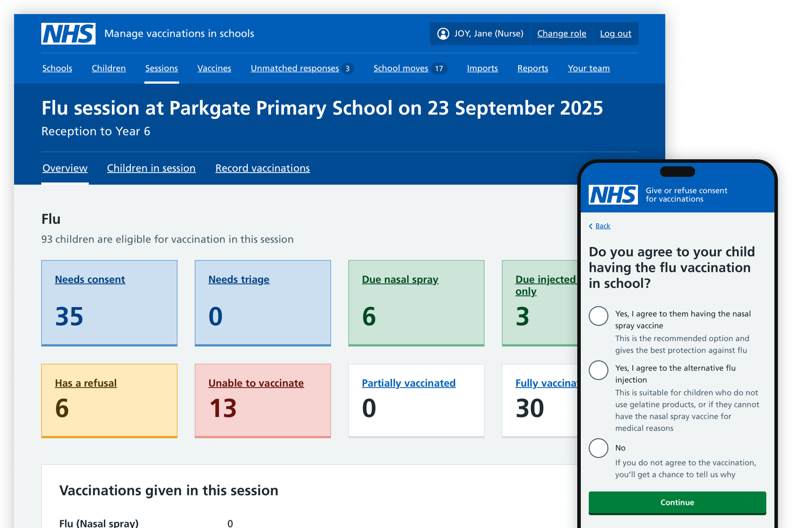
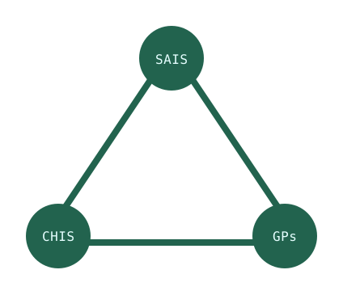
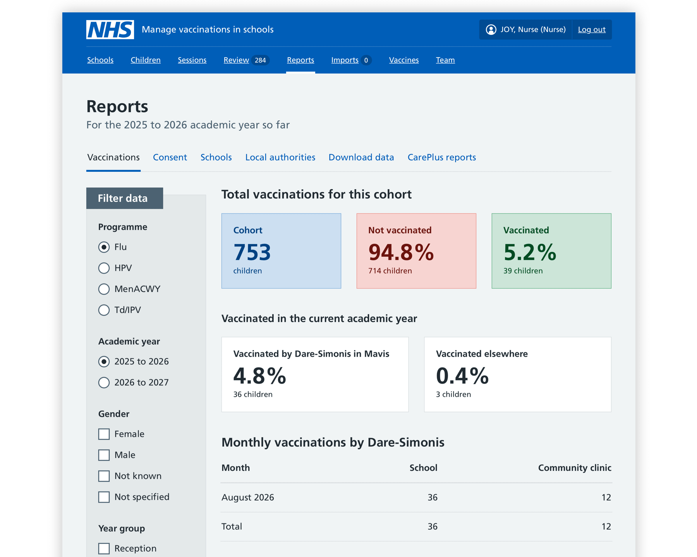

In under 18 months, Mavis grew from 6 teams and half a million children to 96 teams and 4.75 million children. Providers weren't required to adopt it, but they chose to.

Nurses can access the information they need without cross referencing spreadsheets and GP records by eye. NHS commissioners can see how well programmes are running week by week.

We mapped where vaccination data gets lost between GPs, School Age Immunisation Service (SAIS) teams, and child health services, and built an end-to-end service from there, keeping user research, clinical safety, and policy input running throughout.

---

## Problem

The NHS came to us with a complex landscape of disparate providers, incompatible systems, and unmatched data sources. We designed a solution that provides those that need it with easy access to accurate and timely vaccination data - addressing known problems of low uptake, outdated consent, and fragmented data.

---

## Approach

Our discovery work started broad - we mapped the entire ecosystem to identify how, when and where vital vaccination data gets lost in the 'Bermuda triangle' between GPs, SAIS teams, and child health services.

We researched across the full range of users (SAIS teams, parents, children and young people, schools and commissioners) and kept researching after go-live so the service keeps improving in response to real use. Information governance and clinical safety assurance were built in from the start rather than bolted on, with dedicated information governance and clinical safety leads embedded in the team.

By maintaining daily releases and working collaboratively with clinical safety, data protection, and governance colleagues across the NHS, we demonstrated that rapid iteration is possible in a highly regulated environment. We redesigned the clinical governance process so that low-risk changes could proceed without a full Clinical Safety Group review, while still completing safety statements for audit purposes. We changed how the NHS assures the clinical safety of software. We worked closely with NHS England's policy team throughout, feeding back findings and shaping decisions together to ensure Mavis delivers outcomes, not just outputs.

Getting the service into users' hands quickly meant we gained real data on vaccine uptake and service performance - evidence that would have taken years to collect through traditional approaches, now directly informing NHS strategies to offer more childhood vaccinations in more settings, and to use the NHS App to signpost missed vaccinations.

Starting with one vaccination type in a limited area provided valuable real-world feedback for rapid iteration, enabling us to deliver a comprehensive, end-to-end service that allows:

- Matching and consolidation of child records from multiple sources.
- SAIS teams to manage child cohorts for multiple vaccination types.
- Parents/carers to automatically receive and respond to online consent requests.
- SAIS teams to triage children and record vaccinations.
- Vaccination data to be automatically shared with NHS and GP systems.

We support every part of the live service, including live ops and incident response, which keeps us close to how Mavis is actually used and lets us iterate quickly.

---

## Outcome

**In under 18 months, Mavis grew from 6 teams and half a million children to 96 teams and 4.75 million children in Summer 2026, with full rollout continuing into 2027.**

Examples of what Mavis users tell us they value most:

- NHS-branded consent requests and automated reminders are seen by parents as more trustworthy than previous approaches
- Live response rate dashboards let SAIS teams target non-responders directly, without going through schools
- Automated NHS number matching achieves over 98% coverage, removing a significant manual burden.

Parents have stated that it “works perfectly especially for all the parents at work every day,” and another was “really impressed with the communication” and ease of giving consent.

- **2.17 million vaccinations** administered during the first 12 months

- **235% increase** in responses from parents giving consent

- **£15 million** predicted annual savings
  {.box-list}

The Bermuda triangle of vaccination data getting lost is getting smaller. Next, we're making every child's vaccination history more accurate and complete - so the NHS sees the full picture and no child falls through the gap.
